:::::: news
::::: columns
::: {.column .image}
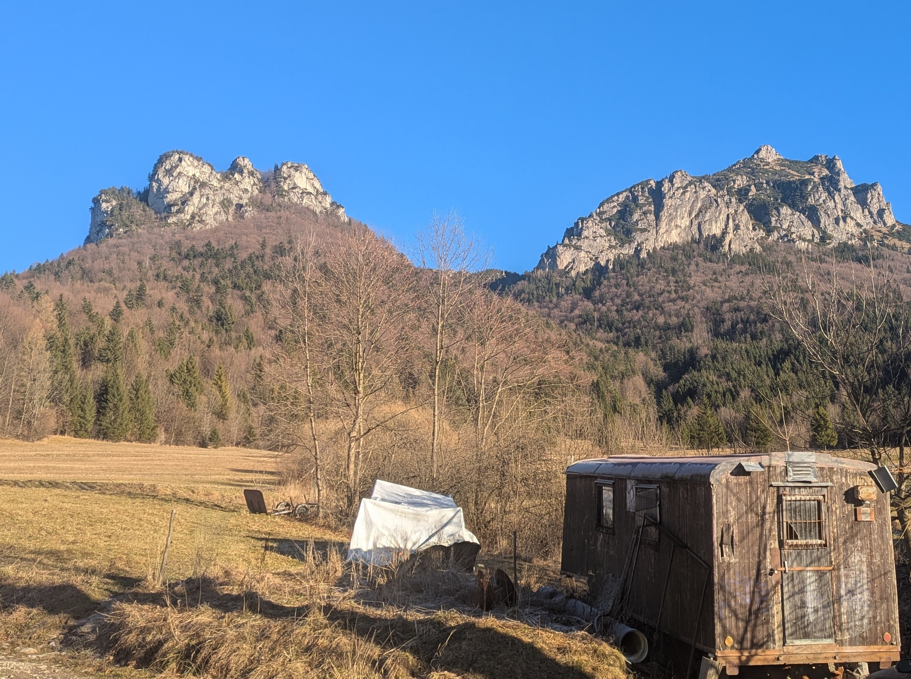{fig-alt="Rozsutce"}
:::

::: {.column .content}
## Terénne práce v Kryštálovej jaskyni

**2025/12**   Nela a Peter zrealizovali tohoročné posledné terénne práce v Kryštálovej jaskyni pod Rozsutcom. Potrebovali sme dovzorkovať sediment v jaskyni a odobrať vzorku pôdy nad jaskyňou. Po návšteve Terchovských jaskyniarov sme transpotrovali vzorky do laboratórií SAV v Banskej Bystrici, aby sme ich odovzdali Adrianovi Biroňovi, s ktorým spolupracujeme.
:::
:::::
::::::

:::::: news
::::: columns
::: {.column .image}
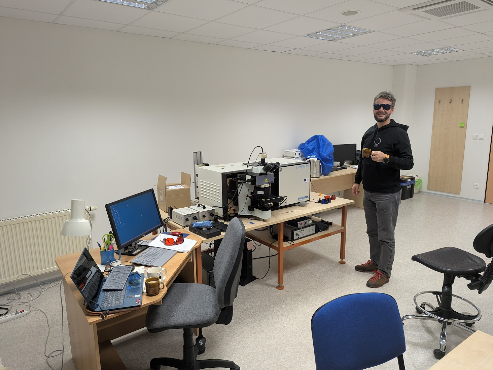{fig-alt="SAV BB"}
:::

::: {.column .content}
## Spolupráca s laboratóriami Ústavu Vied Zemi a Vesmíre SAV v Banskej Bystrici

**2025/11**   Stanka a Nela spolupracovali na analýzach plynu zachyteného vo fluidných inklúziách jaskynných kryštálov. Na analýzu bolo bezplatne poskytnuté laboratórium UVE SAV v BB v čase mimo pracovných hodín. Stanka zdieľala svoju expertízu v oblasti Ramanovej spektrometrie a spoločne zanalyzovali niekoľko vzoriek fluidných inklúzií z kalcitu a fluoritu. Merania sa zúčastnil aj Peter, ktorý sa v tom čase venoval dokumentačným a osvetovým prácam ohľadom jaskýň bratislavského kraja.
:::
:::::
::::::

:::::: news
::::: columns
::: {.column .image}
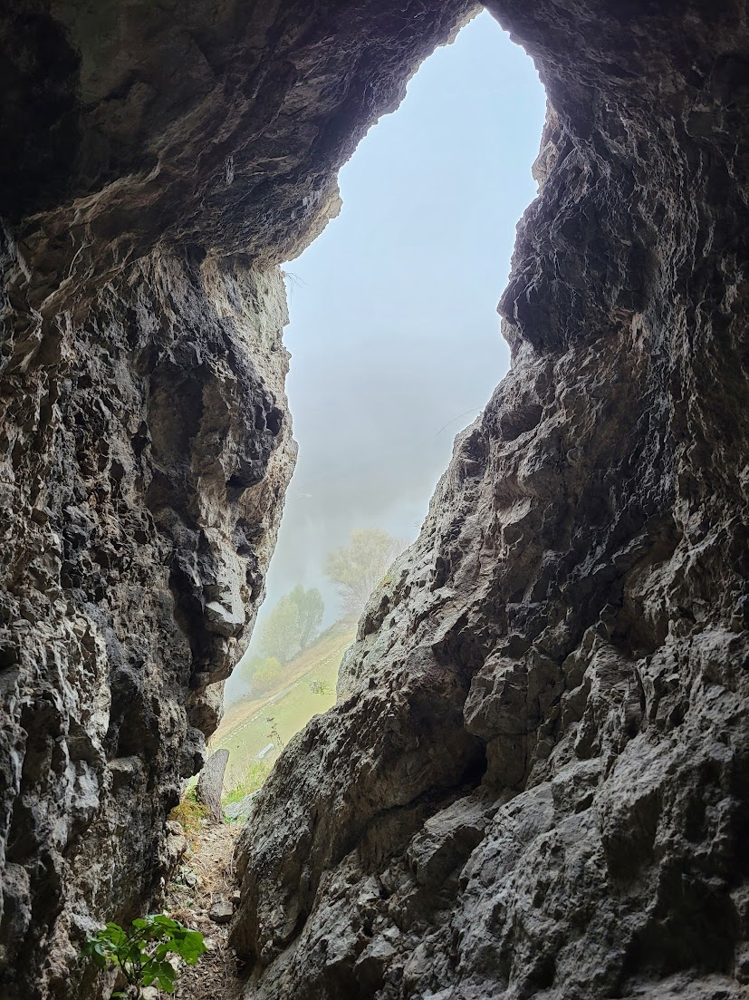{fig-alt="Jaskyňa v hradnom brale"}
:::

::: {.column .content}
## Prieskum a dokumentácia jaskýň v Hradnom brale Hradu Devín

**2025/10**   Peter zdokumentoval niekoľko známych jaskýň v hradnom brale na Devíne pri Bratislave, identifikoval výskyt zaujímavých jaskynných výplní. Všetky jaskyne tejto lokality sú klasifikované ako verejnosti neprístupné a ich návšteva podlieha špecifickej výmimke.
:::
:::::
::::::

:::::: news
::::: columns
::: {.column .image}
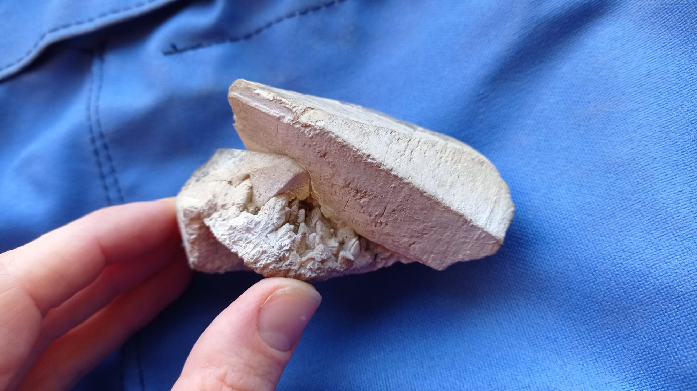{fig-alt="Kalcit"}
:::

::: {.column .content}
## Identifikácia nového Výskytu veľkých kalcitových kryštálov v jaskyni

**2025/11**   Laura a Pavel zdokumentovali nový výskyt kryštálov v jaskyni na Liptove. Podobné kryštály sa nachádzajú na viacerých lokalitách v okolí a ukrývajú informácie o dávnom hydrologickom a termálnom vývoji jaskýň a okolitých hornín.
:::
:::::
::::::

:::::: news
::::: columns
::: {.column .image}
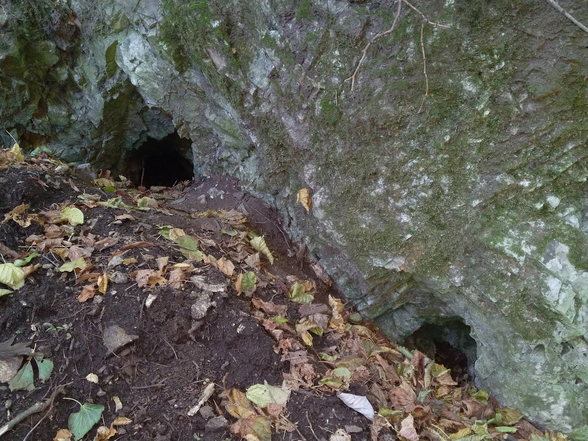{fig-alt="Jaskyne"}
:::

::: {.column .content}
## Nové kratšie jaskyne v oblasti Hlbokej brázdy v Bratislave

**2025/10**   Peter zdokumentoval viacero menších, dosiaľ neznámych jaskýň v katastri Bratislavy. Všetky jaskyne tejto lokality sú klasifikované ako verejnosti neprístupné a ich návšteva podlieha špecifickej výmimke.
:::
:::::
::::::

:::::: news
::::: columns
::: {.column .image}
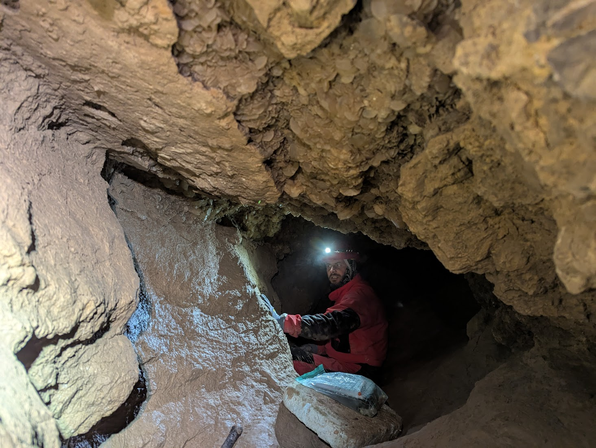{fig-alt="Kryštálová jaskyňa"}
:::

::: {.column .content}
## Terénne práce v Kryštálovej jaskyni pod Rozsutcom

**2025/09**   Nela a Peter zrealizovali terénne práce v Kryštálovej jaskyni pod Rozsutcom v spolupráci s Tomášom a Milkou z lokálnej jaskyniarskej skupiny Adama Vallu z Terchovej, ktorí nám poskytli kľúče od jaskyne a cenné informácie. Cieľom prác bol odber in-situ vzoriek sedimentu a bezprostredne (stratigraficky) blízkych kryštálov z dvoch profilov, kde pozorujeme rôzne stratigrafické vzťahy kryštál-sediment. Vzorkovanie bolo realizované na základe povolenia č. OU-BA-OSZP1-2025/308259-034.
:::
:::::
::::::

:::::: news
::::: columns
::: {.column .image}
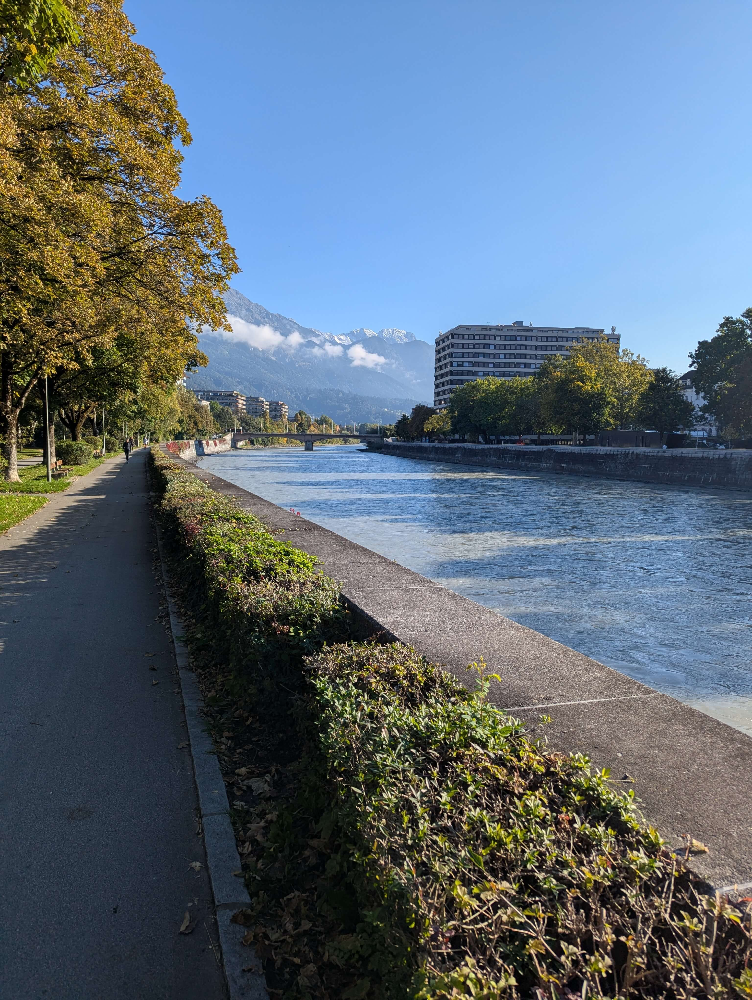{fig-alt="Univerzita v Innsbrucku"}
:::

::: {.column .content}
## Výskumná stáž na univerzite v Innsbrucku

**2025/09**   Nela získala štipendium od NŠF na trojmesačnú stáž na univerzite Franza Leopolda v Innsbrucku, kde sa bude venovať analytickej práci na vzorkách z Kryštálovej jaskyne pod Rozsutcom (Malá Fatra). Plánované sú analýzy fluidných inklúzií a stabilných izotopov vo vzorkách kalcitu z tejto, a niekoľkých ďalších, kryštálových jaskýň.
:::
:::::
::::::

:::::: news
::::: columns
::: {.column .image}
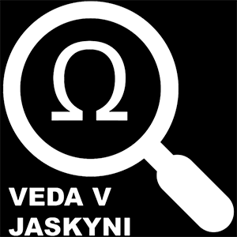{fig-alt="VVJ"}
:::

::: {.column .content}
## Získali sme povolenie na realizáciu ďalších terénnych prác a odber vzoriek z kyrštálových jaskýň

**2025/7**   Okresným úradom životného prostredia v Bratislave nám bolo udelené povolenie č. OU-BA-OSZP1-2025/308259-029/LAJ a č. OU-BA-OSZP1-2025/308259-034 na výskum a odber vzoriek z kryštálových jaskýň na Slovensku, na územiach vybraných národných parkov a chránených krajinných oblastí, so súhlasom Správy slovenských jaskýň.
:::
:::::
::::::

:::::: news
::::: columns
::: {.column .image}
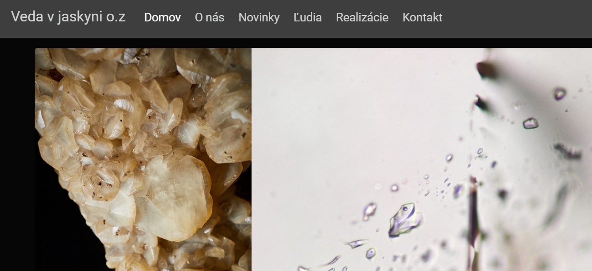{fig-alt="Web"}
:::

::: {.column .content}
## Náš nový WEB, vitaj!

**2025/5**   Nela s Lukášom dali dohromady našu webstránku:) Priebežne budeme pridávať content, upravovať dizajn, a pridávať novinky na ktorých pracujeme.
:::
:::::
::::::

:::::: news
::::: columns
::: {.column .image}
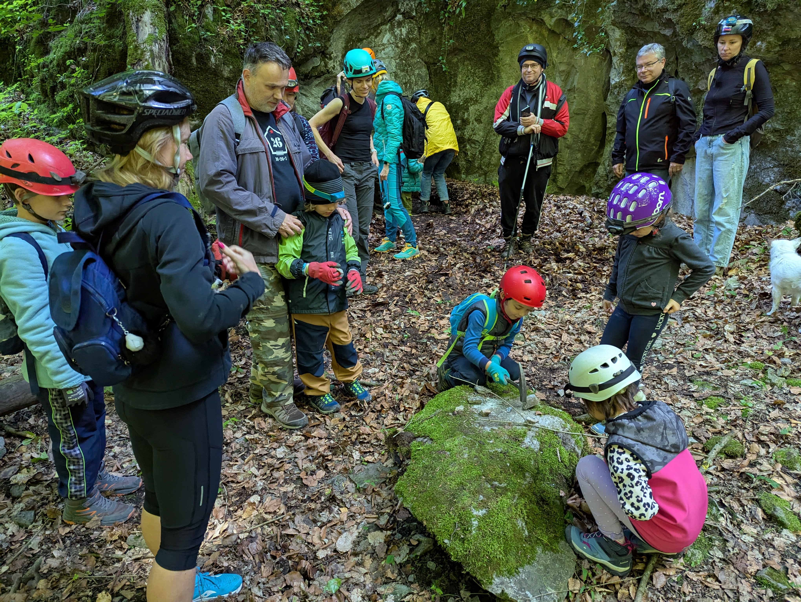{fig-alt="Exkurzie"}
:::

::: {.column .content}
## Speleoexkurzie s Ekocentrom Stupava

**2025/4**   Nela s Petrom zrealizovali sériu náučných exkurzií pre rodiny s deťmi, zameraných na environmentálnu výchovu a spoznávanie krasu, ochranu krasových vôd a praktické ukážky geochemických a geologických procesov prebiehajúcich v krasovej krajine. Exkurzie boli organizované Ekocentrom Stupava, konali sa v krasovom území spravovanom Speleoklubom Bratislava. Účastníci exkurzií podporili svojím príspevkom výskum a prieskum jaskýň.
:::
:::::
::::::

:::::: news
::::: columns
::: {.column .image}
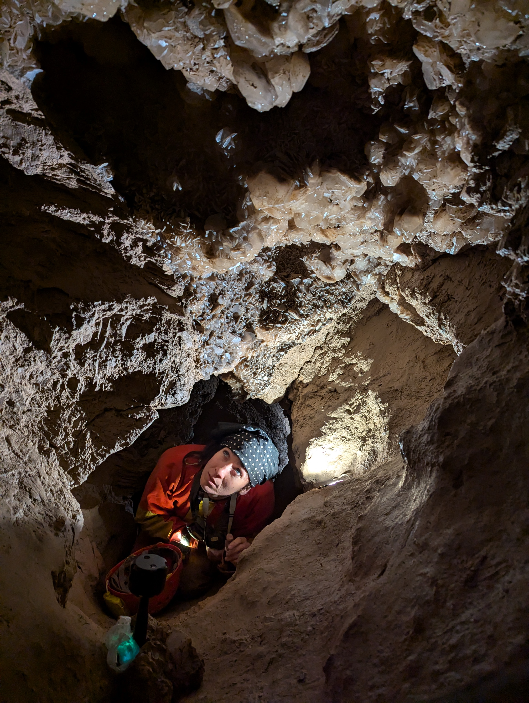{fig-alt="3D fotografovanie"}
:::

::: {.column .content}
## Virtuálna prehliadka Kryštálovej jaskyne pod Rozsutcom

**2024/8**   Laura s pomocou Nely a Petra vytvorila 3D fotodokumentáciu Kryštálovej jaskyne pod Rozsutcom, ktorú následne použila na vytvorenie 3D virtuálnej prehliadky tejto jaskyne. Prehliadku Nela neskôr anotovala fotografiami a textami vychádzajúcimi s nášho výskumu. Prehliadku nájdete TU. Aj takouto formou vieme priblížiť verejnosti tajomstvá ukryté v nesprístupnených jaskyniach. Za sprievod v teréne a spoluprácu ďakujeme Štefanovi Muchovi z Jaskyniarskej skupiny Adama Vallu v Terchovej. Za zapožičanie technického vybavenia na zostavenie 3D fotografií ďakujeme Technickej univerzite v Košiciach.
:::
:::::
::::::

:::::: news
::::: columns
::: {.column .image}
{fig-alt="grant"}
:::

::: {.column .content}
## Uchádzali sme sa o grant Nadácie ESET na podporu environmentálneho vzdelávania a komunikácie vedy

**2024/3**   Dominik a Nela spísali žiadosť o grant nadácie ESET na podporu komunikácie a popularizácie výsledkov vedeckého výskumu realizovaného v Kryštálovej jaskyni pod Rozsutcom. Náš projekt tentokrát nebol finančne podporený, budeme hľadať alterantívy aby sa nám podarilo ciele napriek tomu naplniť a naše výsledky verejnosti priblížiť.
:::
:::::
::::::

:::::: news
::::: columns
::: {.column .image}
{fig-alt="Hello World!"}
:::

::: {.column .content}
## Hello World!

**2023/7**   Vznikli sme:)
:::
:::::
::::::
